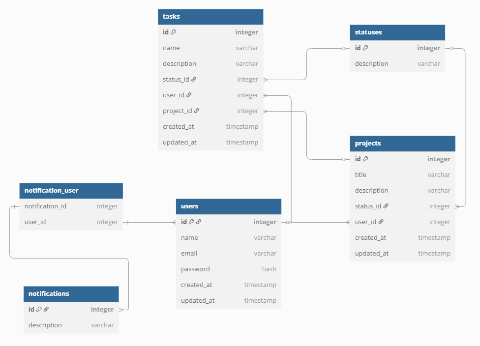

# GERENCIADOR DE TAREFAS

Esse projeto tem como objetivo o desenvolvimento de uma API RESTful visando implementar funções de:

- Cadastro, autenticação, visualização, edição e remoção de entidades (usuários, projetos e tarefas).
- Tratamento de erros completa, abrangendo erros específicos e retornando códigos e mensagens amigáveis ao usuário.
- Serviço de logs para controle de erros e monitoria de transações realizadas, como autenticações e alterações críticas de elementos.
- Serviço de mensageria com foco em notificações (email e popup) / simulação do processamento da fila sendo realizada pelo MongoDB.
- Realização de testes de forma a validar o sistema de forma unitária e completa.

## CONFIGURAÇÃO

Para realizar a configuração do projeto, é recomendado o uso de Docker, que será mostrado abaixo, porém na seção abaixo estão descritas todas as tecnologias utilizadas e que podem ser instaladas e configuradas individualmente e localmente.

Recomenda-se também o uso do Docker Engine, ao invés do convencional Docker Desktop, que pode ser instalado e configurado diretamente via WSL ou Linux pelo link: [Instalar o Docker com Docker Engine (Docker Nativo)](https://github.com/codeedu/wsl2-docker-quickstart?tab=readme-ov-file#instalar-o-docker-com-docker-engine-docker-nativo)

1) Copiar a .env.example como .env.
2) Adicionar os parâmetros (DB_USERNAME, DB_PASSWORD), (MONGO_USER, MONGO_PASSWORD), (RABBITMQ_USER, RABBITMQ_PASSWORD), para fins de teste, foi colocado o mesmo valor para todos, 'admin'.
3) Verificar seu código de usuário e grupo de usuário usando os comandos (id -u) e (id -g) e colocando nos parâmetros UID e GID (geralmente 1000 para ambos), respectivamente, para garantir o permissionamento correto do projeto.
4) Rodar o comando docker-compose up -d.
5) Aguardar a instalação de todos os componentes.
6) Verificar se os seis containeres foram ativados, sendo eles o nginx, senior-hcosta, mongo, postgres, rabbitmq e redis.
7) Rodar os comandos para gerar as credenciais da aplicação e de autenticação:
    - docker exec -it senior-hcosta php artisan key:generate
    - docker exec -it senior-hcosta php artisan jwt:secret
8) Rodar o comando docker exec -it senior-hcosta php artisan migrate:fresh --seed para inicialização da base de dados e criação dos dados padrões usados nas tabelas statuses e notifications.
8) Se necessário, solicitar a documentação das rotas e realizar os testes necessários para validação e uso da API.
9) A URL padrão para acessar as rotas é localhost:8000/api e destaca-se a necessidade de para todas as rotas, exceto /register e /login adicionar o Bearer Token gerado na aba de Authorization.

## TECNOLOGIAS USADAS

- **Laravel 12:** framework base para desenvolvimento, visando otimizar e tornar o projeto mais seguro, eficiente e que contenha boas práticas.
- **PHP 8.3:** linguagem base do Laravel, responsável pela programação do backend da API.
- **RabbitMQ 3:** serviço de mensageria utilizada para transmissão de mensagens, com foco no uso de notificações.
- **MongoDB 6:** banco de dados não relacional baseado em documentos, utilizado para registro de logs gerais, como de autenticação e erros.
- **Postgres 15:** banco de dados relacional responsável por garantir a persistência dos dados da aplicação.
- **Horizon 5:** serviço de monitoramento e gerenciamento de filas, responsável por garantir que as filas sejam executadas e gerar visualizações/métricas para análise.
- **Redis 7:** não utilizado propriamente, mas necessário para instalação e configuração inicial do Horizon.
- **Postman 11:** utilizado para realizar as requisições e documentar as rotas do projeto para facilitar uso.
- **Nginx 1**: servidor web utilizado para a aplicação Laravel, garantindo performance, segurança e roteamento adequado das requisições.
- **Supervisord 4**: gerenciador de processos responsável por manter o PHP-FPM e as filas ativas continuamente.

## ESTRUTURA DE PROJETOS

O projeto segue o padrão **MCV** para **APIs RESTful**, incluindo também os padrões **Service Layer** (camada responsável por conter as regras de negócio/serviço da aplicação) e a **Repository Layer** (responsável por gerenciar e manipular os dados das bases de dados, servindo como intermediário entre o serviço e o modelo).

A estrutura de diretório segue descrita abaixo:

#### **database:**
- migrations: responsável pela inicialização da base de dados.
- seeders: responsável pela criação de dados padrão e geralmente imutáveis (statuses e notifications).

#### **app:**
- Http:
    - Controllers: controladores responsáveis pelas requisições HTTP.
    - Middleware: camadas intermediárias para autenticação, CORS, etc.
    - Requests: validações personalizadas para entrada de dados.
- Interfaces: contratos para implementação de repositórios e serviços.
- Jobs: tarefas assíncronas para processamento em background.
- Models: representações das entidades do sistema.
- Policies: regras de autorização para acesso a recursos.
- Repositories: camada de acesso a dados com separação da lógica de persistência.
- Services: camada de regras de negócio e orquestração.
- Traits: blocos reutilizáveis de código para múltiplas classes.

#### **config:**
- auth.php: define as configurações de autenticação.
- database.php: gerencia as conexões com bancos de dados.
- horizon.php: configura a ferramenta para monitoramento e controle de filas.

#### **bootstrap:**
- app.php: responsável por carregar e retornar a instância principal da aplicação, nela foi realizada o registro das middlewares e o tratamento personalizado de exceções.

## ESTRUTURA DE DADOS

O banco de dados relacional é composto por seis tabelas principais, descritas abaixo:

- **users:** tabela responsável por guardar dados de usuário e usada para autenticação.
- **projects:** tabela responsável por guardar os dados de projetos criados pelos usuários.
- **tasks:** tabela responsável por guardar as tarefas de determinados projetos criados pelos usuários.
- **notifications:** tabela auxiliar para guardar os tipos de notificações existentes em sistema.
- **notification_user:** tabela pivô para guardar a relação entre as notificações que um usuário pode ter habilitada e seus respectivos tipos.
- **statuses:** tabela auxiliar para guardar os tipos de status que um projeto ou uma determinada tarefa pode possuir.

O banco de dados não relacional consiste em três coleções, descritas abaixo:

- **errors:** responsável por armazenar exceções em sistema, como erros de autenticação, banco de dados, entre outros, de forma a facilitar o rastreamento e monitoria de erros.
- **logs:** responsável por armazenar execuções de ações específicas no usuário, como login/logout, criação/edição de projetos, entre outras tarefas, de forma a facilitar a monitoria das ações de usuários.

## REGRAS DE NEGÓCIO

Em relação às regras de negócio, foram tomadas algumas decisões de forma a deixar o processo consistente.

- Todo o fluxo deve ter autenticação via **token JWT**, de forma a tornar o processo seguro.
- Somente o dono de um projeto pode editar/deletar um projeto, porém foi permitido que qualquer usuário possa adicionar tarefas em um determinado projeto, dando autorização para o dono do projeto, de forma semelhante ao dono da tarefa, de atualizar e remover os itens.
- Somente usuários atribuídos à tarefa podem atualizá-la, nesse ponto foi acrescentado também a possibilidade do criador do projeto e do criador da tarefa ter autorização, incluindo atualização de tarefas, além do próprio usuário responsável.
- Sempre que ações de login/logout, criação/edição de projetos e criação/edição de tarefas forem realizadas, **será registrado uma log no banco MongoDB** de forma a manter o histórico dessas ações.
- Sempre que uma nova tarefa for criada ou um usuário for atribuído a uma tarefa, **uma notificação será enviada para o serviço de mensageria (RabbitMQ)** de forma a ser distribuída. Nesse quesito, foram consideradas duas situações, quando uma criação de tarefa for realizada, o criador do projeto será notificado, quando uma tarefa for atualizada, o criador do projeto, o criador da tarefa e o usuário atribuído será notificado. Destaco que o usuário será notificado em todas os tipos de notificações que foram habilitadas no registro.

## TESTES

